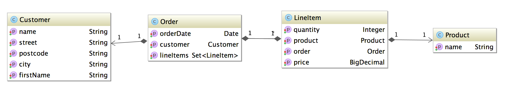

# CUBA Ordermanagement JUGHH

This is an example CUBA application that is used for the Java User Group Hamburg live demo.


### current domain model

The example contains the following domain model that is the starting point for the application:


### Example requirements

The following example requirements have to be implemented in the application:

1. extend domain model
    * store information about the order state so that it can distinguished between open, billed, payed and delivered orders
    * categories the products via a product category. The categories should be editable through the user
2. filter requirements
    * filter for orders that have been placed within the last year
    * filter for orders that contain a product within a given category
3. security
    * create user "jesse" that is only allowed to manage products and their categories
    * create user "walter" which is a sales person with the sales area northeast of the US
4. programming
    * print the latest order for a selected customer in the customer list

For more information around the topics you can take a look at the blog posts:

* [CUBA Filters - the fast food of business software - Road to CUBA and beyond](https://www.road-to-cuba-and-beyond.com/cuba-filters-the-fast-food-of-business-software/)
* [CUBA Security subsystem distilled - Road to CUBA and beyond](https://www.road-to-cuba-and-beyond.com/cuba-security-subsystem-distilled/)

### Branches

In this example application you'll find four branches, that already have implemented the solution for the different example requirements.
If you want to look at a certain solutions just do the following command line magic:

````
git clone https://github.com/mariodavid/cuba-ordermanagement-jughh.git
cd cuba-ordermanagement-jughh
git checkout my-branch
````
